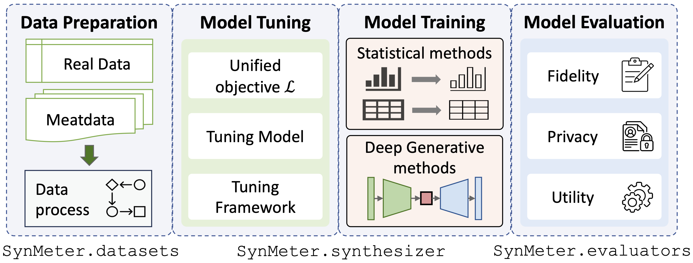

<h2 align="center">
  
</h2>

<h2 align="center">

  <br>
    <sup><sup><sup>Generated by DALL·E 3</sup></sup></sup>
  </br>
Systematic Assessment of Tabular Data Synthesis Algorithms
<!-- </h2>
  <p align="center">
    <a href="https://zealscott.com/"><strong>Yuntao Du</strong></a>
    and 
    <a href="https://www.cs.purdue.edu/homes/ninghui/"><strong>Ninghui Li</strong></a>
    <br>
    Purdue University
    <br>
  <p>
<p> -->

<h4 align="center">
    A principled library for tuning, training, and evaluating tabular data synthesis.
</h4>


<div align="center">
  
</div>

## What's New
[Nov 24, 2024] We add a new SOTA HP synthesizer [REaLTabFormer](https://arxiv.org/pdf/2302.02041) to SynMeter! Try it out!

[Sep 18, 2024] We add a new SOTA HP synthesizer [TabSyn](https://openreview.net/forum?id=4Ay23yeuz0) to SynMeter! Try it out!


## Why SynMeter:
- :dizzy: Easy to add new synthesizers, seamlessly tuning, training, and evaluating various synthesizers.
- :cyclone: Principled evaluation metrics for fidelity, privacy, and utility for both Differential Private (DP) and Heuristic Private (HP) synthesizers.
- :fire: Several SOTA synthesizers, by type:
    - Statistical methods: MST, PrivSyn
    - GAN-based: CTGAN, PATE-GAN
    - VAE-based: TVAE
    - Diffusion-based: TabDDPM, TabSyn, TableDiffusion
    - LLM-based: GReaT, REaLTabFormer


## :rocket: Installation


Create a new conda environment and setup:
```sh
conda create -n synmeter python==3.9
conda activate synmeter
pip install -r requirements.txt # install dependencies
pip install -e . # package the library
```

Change the base dictionary in `./lib/info/ROOT_DIR`:
```
ROOT_DIR = root_to_synmeter
```


## :boom: Usage

### Datasets
*  SynMeter provides 12 standardized datasets with train/val/test datasets for benchmarking, which can be downloaded from here: [Google Drive](https://drive.google.com/file/d/1WWvT5NemPC5ZhGXh5E2_80rrTAO-QQ7d/view?usp=sharing)
*  You can also easily use an additional dataset by putting it to `./dataset`. 

### Tune evaluators for utility evaluations
* Machine learning affinity requires machine learning models with tuned hyperparameters, SynMeter provides 8 commonly-used machine learning models and their configurations in `./exp/evaluators`.
* You can tune these evaluators on your customized dataset:
```sh
python scripts/tune_evaluator.py -d [dataset] -c [cuda]
```

### Tune synthesizer
We provide a unified tuning objective for model tuning, thus, all kinds of synthesizers can be tuned by just a single command:
```sh
python scripts/tune_synthesizer.py -d [dataset] -m [synthesizer] -s [seed] -c [cuda]
```

### Train synthesizer
After tuning, a configuration should be recorded to `/exp/dataset/synthesizer`, SynMeter can use it to train and store the synthesizer:
```sh
python scripts/train_synthesizer.py -d [dataset] -m [synthesizer] -s [seed] -c [cuda]
```


### Evaluate synthesizer
Assessing the fidelity of the synthetic data:
```sh
python scripts/eval_fidelity.py -d [dataset] -m [synthesizer] -s [seed] -t [target] 
```

Assessing the privacy of the synthetic data:
```sh
python scripts/eval_privacy.py -d [dataset] -m [synthesizer] -s [seed]
```

Assessing the utility of the synthetic data:
```sh
python scripts/eval_utility.py -d [dataset] -m [synthesizer] -s [seed]
```

The results of the evaluations should be saved under the corresponding dictionary `/exp/dataset/synthesizer`.


## :book: Customize your own synthesizer
One advantage of SynMeter is to provide the easiest way to add new synthesis algorithms, three steps are needed:
1. Write new synthesis code in modularity into `./synthesizer/my_synthesiszer`
2. Create a base configuration in `./exp/base_config`.
3. Create a calling python function in `./synthesizer`, which contain three functions: `train`, `sample`, and `tune`.

Then, you are free to tune, run, and test the new synthesizer!


## 🔑 Methods

### Statistical Methods
| Method | Type | Description | Reference |
|--- | --- | --- | --- |
|**MST**| DP |The method uses probabilistic graphical models to learn the dependence of low-dimensional marginals for data synthesis. | [Paper](https://arxiv.org/abs/1901.09136), [Code](https://github.com/ryan112358/private-pgm)|
|**PrivSyn**| DP | A non-parametric DP synthesizer, which iteratively updates the synthetic dataset to make it match the target noise marginals. | [Paper](https://arxiv.org/abs/2012.15128), [Code](https://github.com/agl-c/deid2_dpsyn)|

### Generative Adversarial Networks (GANs)

| Method | Type | Description | Reference |
|--- | --- | --- | --- |
|**CTGAN**| HP | A conditional generative adversarial network that can handle tabular data.| [Paper](https://arxiv.org/abs/1907.00503), [Code](https://github.com/sdv-dev/CTGAN)|
|**PATE-GAN**| DP | The method uses the Private Aggregation of Teacher Ensembles (PATE) framework and applies it to GANs.|  [Paper](https://openreview.net/forum?id=S1zk9iRqF7), [Code](https://github.com/vanderschaarlab/mlforhealthlabpub/tree/main/alg/pategan) |

### Variational Autoencoders (VAE)

| Method | Type | Description | Reference |
|--- | --- | --- | --- |
|**TVAE**| HP | A conditional VAE network which can handle tabular data.|  [Paper](https://arxiv.org/abs/1907.00503), [Code](https://github.com/sdv-dev/CTGAN) |


### Diffusion Models

| Method | Type | Description | Reference |
|--- | --- | --- | --- |
|**TabDDPM**| HP | Use diffusion model for tabular data synthesis  | [Paper](https://arxiv.org/abs/2209.15421), [Code](https://github.com/yandex-research/tab-ddpm) |
|**TabSyn**| HP | Use latent diffusion model and VAE for synthesis. | [Paper](https://openreview.net/forum?id=4Ay23yeuz0), [Code](https://github.com/amazon-science/tabsyn) |
|**TableDiffusion**| DP | Generating tabular datasets under differential privacy. | [Paper](https://arxiv.org/abs/2308.14784), [Code](https://github.com/gianlucatruda/TableDiffusion) |


### Large Language Model (LLM)-based Models

| Method | Type | Description | Reference |
|--- | --- | --- | --- |
|**GReaT**| HP | Use LLM to fine tune a tabular dataset.| [Paper](https://openreview.net/forum?id=cEygmQNOeI), [Code](https://github.com/kathrinse/be_great) |
|**REaLTabFormer**| HP | Use GPT-2 to learn the relational dependence of tabular data.| [Paper](https://arxiv.org/pdf/2302.02041), [Code](https://github.com/worldbank/realtabformer) |


## :zap: Evaluation Metrics
- **Fidelity metrics**: we consider the Wasserstein distance as a principled fidelity metric, which is calculated by all one and two-way marginals.

- **Privacy metrics**: we devise the Membership Disclosure Score (MDS) to measure the membership privacy risks of both HP and DP synthesizers.

- **Utility metrics**: we use machine learning affinity and query error to measure the utility of synthetic data.

*Please see our paper for details and usages.*


## :rainbow: Acknowledge 
Many excellent synthesis algorithms and open-source libraries are used in this project:
* [Synthetic Data Vault](https://sdv.dev/)
* [Synthcity](https://github.com/vanderschaarlab/synthcity)
